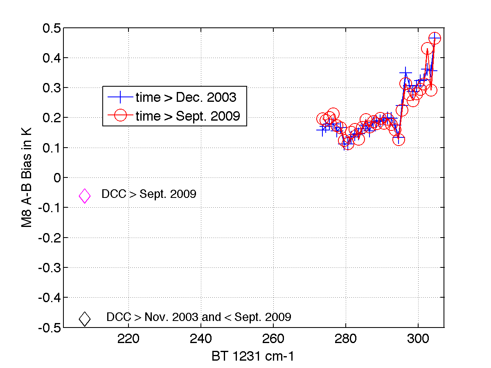

L. Larrabee Strow
=================

    :Author: L. Larrabee Strow

1 Introduction
--------------

We have concentrated on two topics thus far, guided by the fact that
the present CLARREO mission has been cancelled.  First, following our
proposal, we are examining the utility of using changes in radiance
(or brightness temperature) probability distribution functions (PDFs)
as a means of monitoring climate change with infrared hyperspectra
sensors.  Secondly, we are studying the stability of the NASA/EOS AIRS
sensor to determine if AIRS can provide some of the information NASA
hoped to measure with CLARREO.  Of course, AIRS will cease functioning
before the time needed to reliably measure climate change and evaluate
candidate climate models.  Thus, future work will include comparisons
between AIRS and EUMETSAT's IASI sensor and the NOAA/NASA NPP/JPSS
Cris sensor to determine how reliably one can "stitch" together a
climate record from these different sensors.  Preliminary studies
suggest that this can be done close to the 0.1K level, but assigning
error bars at the 2-sigma level will require much more work.

2 Stability of AIRS
-------------------

Here we have examined the stability of AIRS, both from the prespective
of the raw radiance record and compared to available re-analyses
records.  More and more climate studies are done using NWP re-analyses
records and there is some thought that re-analyses will be the best
representation of the historical climate record.  This is somewhat
controversial of course, so studies relating trends in the satellite
record to re-analyses should be illuminating.  Our approach here is to
find clear scenes, and then determine the linear rate-of-change, and
anomaly, of each AIRS spectral channel.  The resulting rate spectra
can then be subjected to an optimal estimation retrieval of
atmospheric temperature, humidity, surface temperature, and minor gas
rates.  This approach also allows us to compare the retrieved trends
to very reliable sea-surface temperature (SST) climate data records in
order to assess the AIRS stability.

This approach may allow an independent measure of long-term SST and
minor-gas trends.  We can only accurately determine nearly clear
scenes over ocean, but that should be sufficient to determine
long-term trends of the well-mixed (and therefore important)
greenhouse gases.  This also means that any comparisons to NWP
re-analysis products, or climate models, are aliased to clear-sky
conditions.  Although we will not show these results here, we have
found that long-term trends under clear vs cloudy conditions are very
similar, both in observations and models.  Trends for all-sky
radiances will be discussed in the next section using PDFs.

 
   Left: 8-year linear B(T) rates for AIRS radiances, tropical ocean.  Right: 8-year linear bias (Obs-ERA) rates, tropical ocean.  The main features are \cd 2 ppm year growth and incorrect ERA ozone rates.

Figure 1 shows the AIRS 8-year clear scene brightness
temperature rates for tropical ocean ± 30 deg.  This year we
developed an optimal estimation retrieval of the geophysical rates
from the observed B(T) rates.  These curves are derived by fitting the
clear, ocean, night AIRS observations, *BT(t)*, to a standard trend
equation,

\\begin{equation}
BT(t) = a + R \* t + \\sum\_{n=1}^{4} c\_{n} sin (2 n \\pi t/T + \\phi\_{n})
\\end{equation}
where *T* =1 year.  This is done for each channel,
giving us a spectrum *R* of linear 8-year radiance rates.  We
generally use daily bins of the observed radiances, also binned by
latitude.
